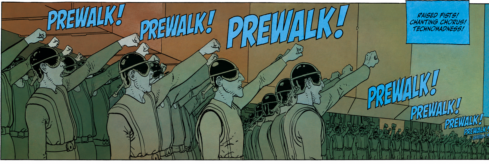

# opencode-prewalk

Prewalk for OpenCode 2: let a frontier model explore, plan, create a todo list, and make the first implementation edit, then continue the **same session** with a faster model.



**Plan with Sol. Finish with Luna. Keep the full trajectory.** Prewalk gives the difficult exploration and first edit to the strongest model, then hands the same grounded session to a faster executor.

The initial defaults are:

```text
planner:          openai/gpt-5.6-sol
planner variant:  high
executor:         openai/gpt-5.6-luna
executor variant: medium
```

## Quick install

Requirements:

- Node.js 20+
- Git and npm
- A current `opencode2` installation
- Authentication for the planner and executor models

Install or update automatically:

```sh
curl -fsSL https://raw.githubusercontent.com/vivekascoder/opencode-prewalk/main/install.sh | bash
```

The installer:

- clones or updates the repository at `~/.local/share/opencode-prewalk`
- installs the plugin's runtime dependencies
- links its entrypoint at `~/.config/opencode/plugins/opencode-prewalk.ts`, where OpenCode discovers global plugins automatically
- preserves a single checkout, so rerunning the same command updates the installation
- refuses to overwrite an existing non-symlink plugin directory

Restart OpenCode after installing or updating.

Installer paths can be overridden:

```sh
export OPENCODE_PREWALK_DIR="$HOME/.local/share/opencode-prewalk"
export OPENCODE_PREWALK_PLUGIN_FILE="$HOME/.config/opencode/plugins/opencode-prewalk.ts"
```

## How it works

1. `/prewalk <task>` switches the current session to GPT-5.6 Sol.
2. A hidden context instruction asks Sol to explore deeply, create a compact todo list, and begin the implementation.
3. Sol records the plan through the plugin's `prewalk_todo` tool. The plugin then waits for a successful edit/write tool. Shell calls, the todo call itself, and failed edits do not trigger the handoff.
4. The current session switches to GPT-5.6 Luna. The planning instruction is no longer inserted, while a one-shot executor nudge tells Luna to finish the existing todo list and validation.

This transfers the grounded trajectory—not a prose summary or a fresh thread—to the executor.

## Manual install

Clone the repository and install its runtime dependencies:

```sh
git clone https://github.com/vivekascoder/opencode-prewalk.git ~/.local/share/opencode-prewalk
npm --prefix ~/.local/share/opencode-prewalk install --omit=dev
```

Add the plugin entry to `~/.config/opencode/opencode.jsonc`. Replace the example with the absolute path to your checkout:

```jsonc
{
  "$schema": "https://opencode.ai/config.json",
  "plugins": ["/absolute/path/to/opencode-prewalk/src/index.ts"]
}
```

If the file already contains settings or plugins, merge this entry into the existing `plugins` array. Restart OpenCode afterward.

To update a manual installation:

```sh
git -C ~/.local/share/opencode-prewalk pull --ff-only
npm --prefix ~/.local/share/opencode-prewalk install --omit=dev
```

When the package is published to npm, the equivalent configuration will be:

```jsonc
{
  "$schema": "https://opencode.ai/config.json",
  "plugins": ["opencode-prewalk"]
}
```

## Usage

```text
/prewalk fix the failing auth refresh tests
/prewalk status
/prewalk off
```

Running `/prewalk` without a task arms the current session; send the task in the next message.

### Headless mode

Pass the task as an argument to the bundled headless wrapper:

```sh
~/.local/share/opencode-prewalk/headless.sh \
  "fix the failing auth refresh tests"
```

This invokes the registered `/prewalk` command through OpenCode's API, waits for the session to finish, and prints the final answer. It uses the current directory as the task directory and connects to the normal OpenCode background service. `opencode2 run "/prewalk ..."` is not equivalent: the `run` subcommand sends slash-prefixed text as an ordinary prompt instead of dispatching a registered command.

### Benchmark against a normal run

Run one task twice from the same Git commit in isolated temporary worktrees:

```sh
~/.local/share/opencode-prewalk/benchmark.sh \
  "fix the failing auth refresh tests"
```

The normal baseline uses GPT-5.6 Sol with the `high` variant for the full task. The Prewalk run begins with the same model and variant, then hands the session to GPT-5.6 Luna with the `medium` variant after the todo-gated first edit. Runs are sequential so they do not compete for local resources. A control instruction prevents the normal run from auto-loading any separately installed Prewalk skill, while the user task itself remains identical.

The script writes a Markdown summary, raw JSON, both Git patches, and a self-contained HTML comparison with context-growth lines superimposed over each tool sequence. By default reports go to `.opencode-prewalk/benchmarks/<timestamp>` in the repository being benchmarked. Temporary worktrees live under `.opencode-prewalk/worktrees` so OpenCode treats them as part of the authorized project; they are removed after their diffs and session data have been captured.

Reports estimate cost using [OpenAI's Standard API pricing](https://developers.openai.com/api/docs/pricing) for Sol and Luna, including uncached input, cached input, cache writes, output, reasoning, and long-context multipliers. The HTML chart plots cumulative input-token usage across the tool sequence.

```sh
# Choose a report location or benchmark another committed revision.
benchmark.sh --output /tmp/prewalk-report --revision main "implement the task"

# Keep both worktrees when you want to run your own verification afterward.
benchmark.sh --keep-worktrees "implement the task"
```

The source checkout is never modified. If it is dirty, the script warns that both runs use the selected committed revision. Override the baseline only when intentionally testing another comparison:

```sh
PREWALK_BENCHMARK_MODEL=openai/gpt-5.6-sol \
PREWALK_BENCHMARK_VARIANT=high \
benchmark.sh "implement the task"
```

By default the runs are sequential to avoid local resource contention. Use `--concurrent` to start both sessions together when wall-clock concurrency is part of the experiment:

```sh
benchmark.sh --concurrent "implement the task"
```

#### Published Kanban benchmark

On August 25, 2026, both modes concurrently implemented the same full-stack Kanban specification from the same commit using Bun, TypeScript, Express, SQLite, REST APIs, and a vanilla frontend. Both applications passed type checking, API tests, and independent startup checks.

| Result | Normal Sol | Prewalk Sol → Luna | Prewalk change |
|---|---:|---:|---:|
| Final idle time | 630s | 808s | +28.3% |
| Estimated Standard API cost | $0.7281 | $0.1492 | **−79.5%** |
| Input tokens | 39,813 | 121,431 | +205.0% |
| Output tokens | 19,007 | 16,465 | −13.4% |
| API tests | 7 | 6 | — |

The normal implementation was more complete and had broader test coverage; Prewalk was substantially cheaper but missed two non-drag UI controls. Concurrent provider resets and a stale exploration child made this a deliberately honest but noisy run. See the [full evaluation](./benchmarks/kanban-concurrent-20260825/evaluation.md), [interactive HTML report](./benchmarks/kanban-concurrent-20260825/report.html), and [raw benchmark data](./benchmarks/kanban-concurrent-20260825/report.json).

## Configuration

Plugin options accept full `provider/model` identifiers and OpenCode model variants:

```jsonc
{
  "$schema": "https://opencode.ai/config.json",
  "plugins": [
    {
      "package": "./src/index.ts",
      "options": {
        "planner": "openai/gpt-5.6-sol",
        "plannerVariant": "high",
        "executor": "openai/gpt-5.6-luna",
        "executorVariant": "medium"
      }
    }
  ]
}
```

For installations whose built-in tools use different names, `todoTools` and `editTools` can be overridden with arrays of tool names. The defaults cover `prewalk_todo`, common built-in todo names, and the `edit`, `write`, `patch`, `apply_patch`, and `multiedit` edit names, including namespaced forms.

## Development

```sh
npm run verify
```

The verification suite typechecks against `@opencode-ai/plugin@beta` and exercises the full arm → planning context → todo gate → successful edit → model switch → instruction scrub lifecycle with a mock OpenCode context.

## Background and license

Based on [Stencil's Prewalk](https://stencil.so/blog/prewalk), [pi-prewalk](https://pi.dev/packages/pi-prewalk), and [codex-prewalk](https://github.com/vivekascoder/codex-prewalk). OpenCode's plugin API is documented in [Build Plugins](https://opencode.ai/v2/docs/build/plugins).

Licensed under Apache License 2.0. See [LICENSE](./LICENSE) and [NOTICE](./NOTICE).
